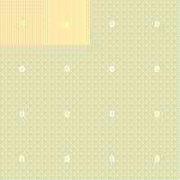

Playing 2048
============
Playing 2048 using Proximal Policy Optimization. Lots of TODO's before
it really performs well. However, the agent already learns to beat the
game after approx. 8 hours of training:

Testing
=======
I use `pytest`. Run the following commands:
* `pytest`
* `pytest --doctest-modules`

TODOS
=====
* Use model wrappers to convert observation space instead of what is done now.
* Add setup.py for installation of dependencies.
* One-hot encoding of observation space instead of numerical values. 
  Probably will be a better representation?
